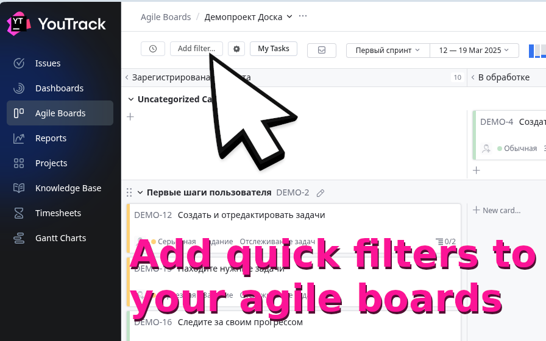
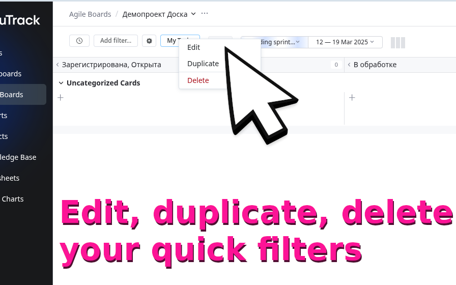
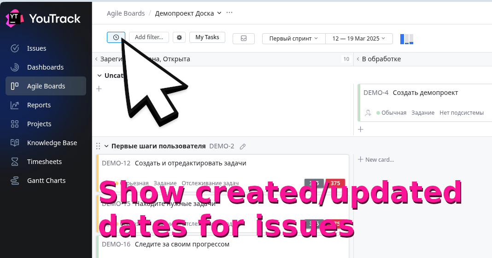
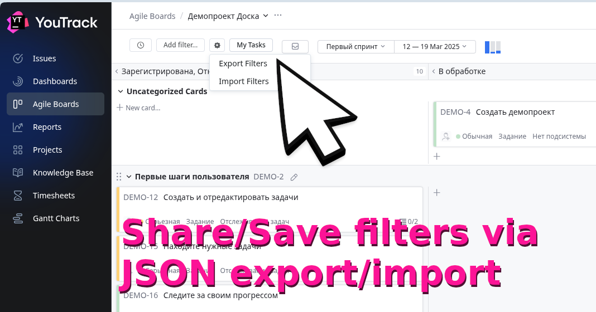
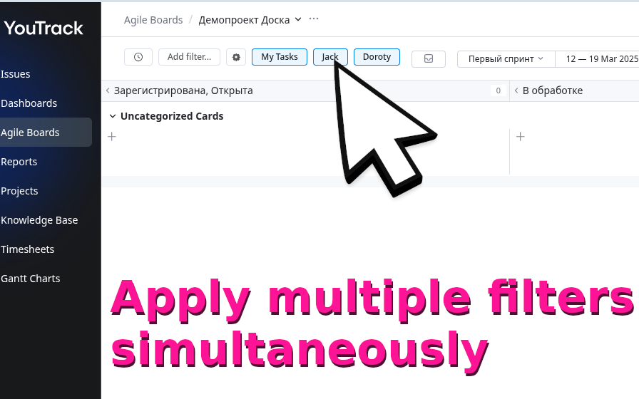

# YouTrack Quick Filters Extended

Fork of [YouTrack Quick Filters](https://github.com/ausievich/yt-quick-filters) by [ausievich](https://github.com/ausievich). Thanks to the original author for the base project and idea.

[](https://chromewebstore.google.com/detail/iaddgmcajdiblafjfhloadmphkbplddo)

Add quick filter buttons to YouTrack Agile Boards. Create filters via a modal, combine them with the current board query, export/import filter sets, and display aging tags on cards.

[Install from Chrome Web Store](https://chromewebstore.google.com/detail/....)

Repository: https://github.com/MihanEntalpo/yt-quick-filters-extended

---

## Features

- Create and manage your own quick filters (e.g. by assignee, state, or any search query).
- Apply filters directly through the YouTrack query UI without reloading the page.
- Toggle filters on and off inside the current board query using `AND`.
- Detect which quick filters are already present in the current query and highlight active buttons automatically.
- Edit, duplicate, or remove filters via a clean UI.
- Export all filters for the current board as JSON.
- Import filters from JSON in either replace or merge mode.
- Merge imported filters by name: update existing ones, add missing ones, and keep unrelated current filters.
- Show a confirmation step before importing filters.
- Display Created and Updated tags on cards.
- Show Days in Status tags on cards and toggle them from the board toolbar.
- Configure Days in Status behavior from the extension popup:
  - show or hide the Created tag
  - color the Created tag
  - use compact format
  - configure yellow and red warning thresholds
- Seamlessly integrated into YouTrack Agile Boards.

This extension brings a long-requested feature (see JetBrains request [JT-38623](https://youtrack.jetbrains.com/issue/JT-38623)) directly into YouTrack.

---

## Screenshots







## Installation

1. Get the extension from the [Chrome Web Store](https://chromewebstore.google.com/detail/...).
2. Open any Agile board in YouTrack.
3. Start adding, combining, exporting, and importing your own quick filters.

---

## Development

### Prerequisites
- Node.js 16+ 
- npm or yarn

### Setup
```bash
# Clone your fork
git clone https://github.com/MihanEntalpo/yt-quick-filters-extended.git
cd yt-quick-filters-extended

# Install dependencies
npm install

# Type checking
npm run type-check

# Production build
npm run build
```

### Load the extension manually:
1. Open `chrome://extensions/`
2. Enable **Developer mode**
3. Click **Load unpacked** and select this repo folder
4. Reload the extension after every local rebuild

---

## Motivation

- Jira has had quick filters for ages ([docs](https://support.atlassian.com/jira-service-management-cloud/docs/create-quick-filters-for-your-board/)).
- YouTrack users have been requesting the same feature for almost 10 years:
    - [YouTrack support forum thread](https://youtrack-support.jetbrains.com/hc/en-us/community/posts/115000751664-Agile-board-Quick-Filters)
    - [Feature request in YouTrack itself](https://youtrack.jetbrains.com/issue/JT-38623/)

This fork continues that idea and extends it with additional workflow features for daily board use.

---

## Contributing

Contributions are welcome!  
If you’d like to improve styles, fix bugs, or add new features:

1. Fork the repo
2. Create a feature branch (`git checkout -b feature/my-feature`)
3. Commit your changes (`git commit -m "Add my feature"`)
4. Push to your fork and open a Pull Request

Please try to keep code style consistent and test your changes locally before PR.

---

## 📄 License

MIT
